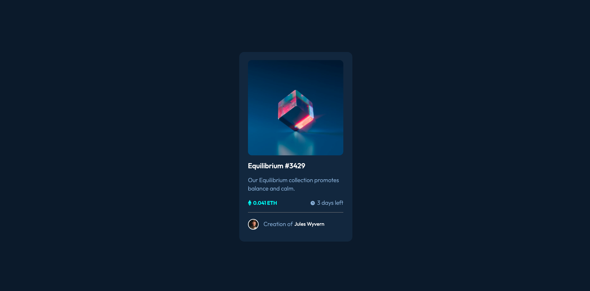

# What I learned

- Used hr element for the first time to make a line.
- Used the correct layout of container
  - root container > card container > contents container and set the contents container to 90%.
- Used position: relative correctly to fix spacing.

